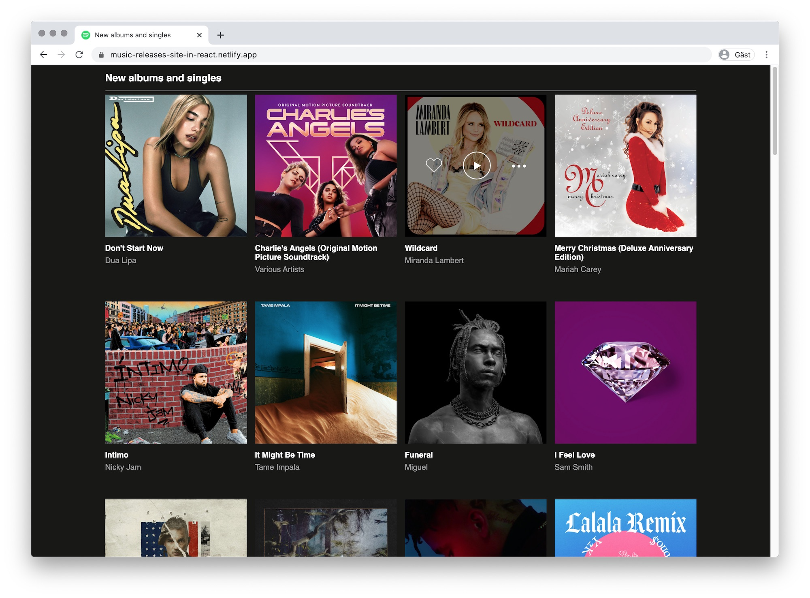

# Music Releases&ensp;|&ensp;[View Live &#10555;](https://music-releases-react-app.netlify.app/)

A Pair Programming assignment and an introduction to React. Responsive styling using Spotify as a guide. 

The goal was to learn the foundations of React and core concepts like components, props and JSX, while also how to solve problems together and work as a team. Made using Live Share in VS Code – taking turns – where one person "drives" and writes code while the other "navigate" and reviews and plan ahead.

Made with Anna Gustafsson.

## Core Tech
* React
* Props
* JSX
* Live Share
* Flexbox

## Screenshot

## View it live
https://music-releases-react-app.netlify.app/
